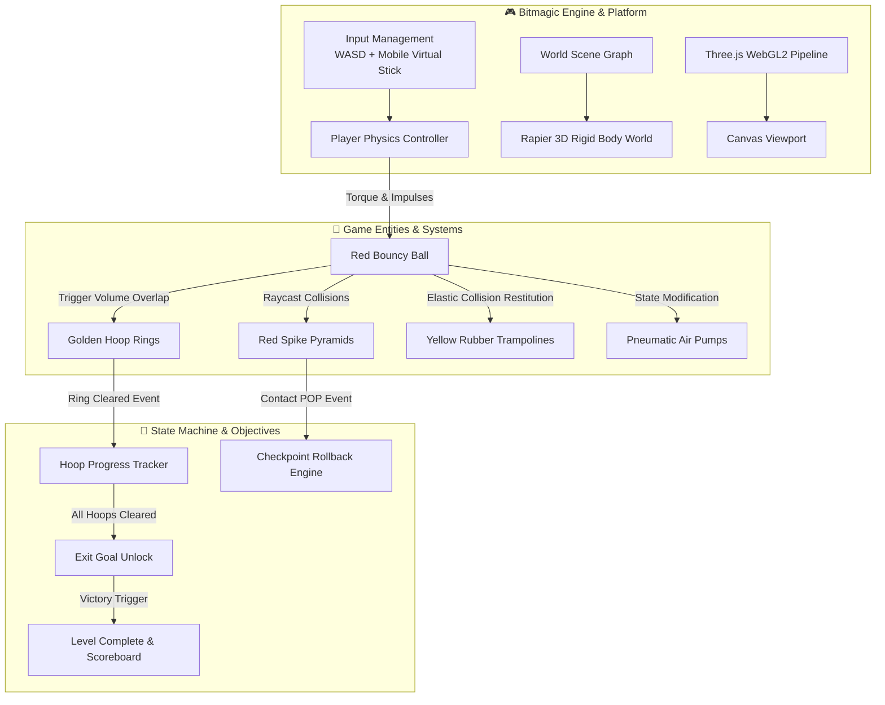
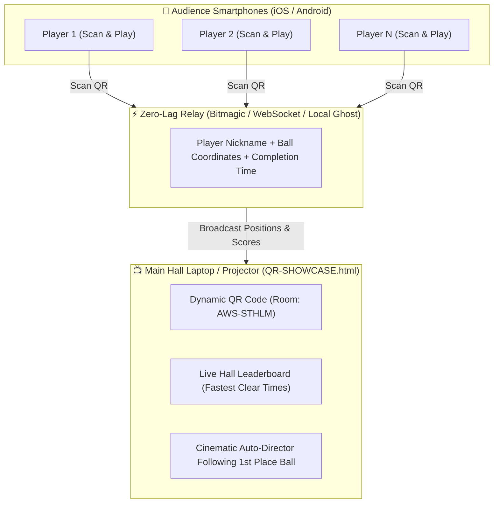
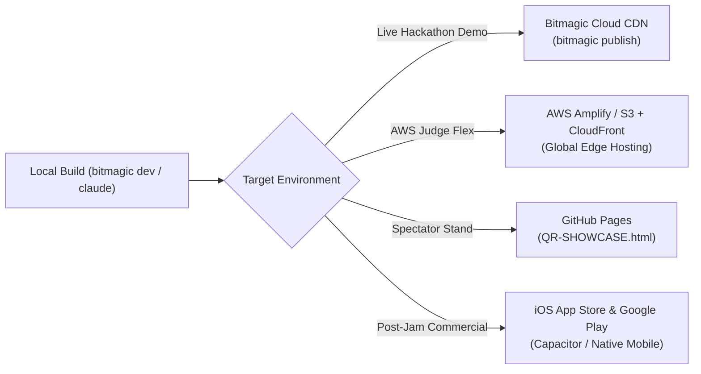

# 🔴 Bounce 3D: Production Engineering Specification

**Project Title**: Bounce 3D (The Nokia Legend Reborn)  
**Target Event**: AWS & Bitmagic Game Jam @ AWS Stockholm  
**Authors**: Akkireddy Challa (Telia) & Co-Engineer (Strawberry)  
**Target Runtime**: WebGL 2.0 / WebGPU (Desktop & Mobile Browser Parity via Bitmagic GDK)  
**Engine Stack**: Bitmagic Engine · Three.js · Rapier 3D Physics · Web Audio API · Anthropic Claude Code  

---

## 1. Executive Summary & Product Vision

### 1.1 The High Concept
In the early 2000s, *Bounce* was the premier pre-installed mobile game on hundreds of millions of Nokia devices (9210 Communicator, 6610, 3510, 6300). Built by Finnish engineers, it defined mobile gaming for an entire generation.

**Bounce 3D** resurrects this iconic piece of Nordic tech heritage into a modern, production-grade 3D physics platformer. Players navigate a high-gloss red sphere through floating geometric obstacle courses, launching off yellow rubber trampolines, threading through golden hoop triggers, dodging perilous red pyramid spikes, and utilizing pneumatic air pumps to alter the ball's volume and buoyancy.

### 1.2 Winning Strategy for AWS Stockholm
- **Emotional Resonance**: Bitmagic’s founders (Ilmari Ihalainen & Markus Kiukkonen) and AWS’s Nordic audience have deep nostalgia for Nokia.
- **Physics Purity**: Rolling sphere mechanics and rigid-body restitution are inherently robust, eliminating buggy character animation glitches under tight 4-hour constraints.
- **Zero-Friction Mobile QR Parity**: Audience members scan a QR code on the laptop screen and instantly play on their smartphone browser with 60 FPS touch controls—enabling dozens of simultaneous peer voters.

---

## 2. System Architecture & Entity Component Model

---

## 3. Detailed Component Specifications

### 3.1 🔴 The Player Entity (`PlayerBall`)
- **Mesh Geometry**: Standard `SphereGeometry(radius: 0.5, segments: 32, rings: 32)`.
- **Material & Shader**: High-gloss candy-apple red (`#EF4444`) with smooth roughness (`0.15`), metalness (`0.1`), and high specular reflection highlight.
- **Physics Rigid Body**:
  - Shape: Continuous Collision Detection (CCD) Sphere collider to prevent tunneling through thin platforms at high velocity.
  - Friction: `0.4` (allows realistic rolling traction).
  - Restitution (Bounciness): `0.65` (satisfying natural bounce).
  - Angular Damping: `0.2` (prevents infinite roll while preserving momentum).
- **Movement Dynamics**:
  - Horizontal Rolling: Apply rotational torque in the camera's directional plane proportional to input vector.
  - Standard Jump: Impulse of `+7.5 m/s` along the Y-axis when grounded.
  - Squash & Stretch: Dynamic vertical scaling (`0.8y / 1.1x / 1.1z`) upon hard surface impacts, interpolating back to `1.0` within 120ms.

### 3.2 🟡 The Golden Hoop System (`HoopTrigger`)
- **Visual Design**: Torus mesh (`TorusGeometry(radius: 1.2, tube: 0.12)`) in metallic gold (`#FBBF24`) emitting a gentle warm point light.
- **Orientation**: Placed perpendicular to the player's traversal trajectory (some upright, some flat).
- **Detection Algorithm**:
  - An invisible planar sensor trigger inside the hoop circumference.
  - Directional vector check: Ensures the ball passes completely through the plane rather than grazing the outer rim.
- **State Transition**:
  - *Uncollected*: Golden glow, subtle floating bobbing animation ($\sin(t \times 2) \times 0.1$).
  - *Collected*: Plays high-frequency chime sound (`880Hz -> 1760Hz`), triggers circular gold particle explosion, ring color shifts to luminescent emerald green (`#10B981`).
  - Emits `HOOP_COLLECTED` event to the Level Manager.

### 3.3 🟡 Rubber Trampolines (`SuperBouncePad`)
- **Visual Design**: Square rubber pad with rounded corners (`#EAB308`) sitting on an accordion metal spring base.
- **Physics Interaction**:
  - Upon downward collision contact from the player, cancels negative Y velocity and applies an amplified upward impulse (`+16.0 m/s`).
  - Animates pad compression (`0.4x scale Y`) for 80ms before spring release.
  - Audio: Low-to-high pitch rubber spring sound effect.

### 3.4 🔺 Red Spike Hazards (`SpikeHazard`)
- **Visual Design**: Clustered sharp tetrahedral cones (`ConeGeometry`) in crimson red (`#DC2626`) with dark metallic bases.
- **Damage Pipeline**:
  - Static colliders with zero restitution.
  - Contact detection triggers immediate `BALL_POP`:
    1. Ball mesh visibility set to false.
    2. Spawns 12 low-poly red rubber fragment particles flying outward with gravity.
    3. Plays sharp "POP!" cartoon sound.
    4. Resets player position to the last safe platform checkpoint after 600ms.

### 3.5 💨 Pneumatic Air Pumps (`SizeMorphStation`)
- **Inflator Pad**:
  - Increases ball radius from `0.5m` to `1.1m`.
  - Decreases density/mass by 50% (allows floating on liquid/energy pools and 1.5x higher bounce).
- **Deflator Pad**:
  - Shrinks ball radius to `0.3m`.
  - Increases density/mass (faster roll, fits into narrow tunnels and low pipes).

### 3.6 🌀 Exit Portal (`LevelExitGoal`)
- **Visual Design**: Swirling vertical particle vortex with stone arch frame.
- **States**:
  - *Locked*: Crimson red barrier (`#EF4444`) with padlock HUD icon showing remaining hoops (e.g. `2/5 Rings`).
  - *Unlocked*: Green energy whirlpool (`#10B981`) emitting beacon beam into the sky. Contact triggers stage victory.

---

## 4. Input & Control Parity Matrix

| Action | Desktop Keyboard | Mobile Touch (Smartphones) | Gamepad |
| :--- | :--- | :--- | :--- |
| **Roll Direction** | `W / A / S / D` or Arrow Keys | Dynamic Virtual Analog Stick (Left Screen) | Left Analog Thumbstick |
| **Bounce / Jump** | `Spacebar` | Floating Tap Button (Right Thumb) | Bottom Face Button (`A` / `Cross`) |
| **Camera Orbit** | Mouse drag or `Q / E` | One-finger swipe on right screen half | Right Analog Stick |
| **Pause / Restart** | `R` (Restart) / `Esc` | Top-right HUD buttons | Start / Select |

---

## 5. Level Progression Architecture

### Level 1: "Sunny Foothills" (Tutorial & Flow)
- **Objective**: Introduce rolling, 4 golden hoops, 1 trampoline jump, wide gentle slopes.
- **Target Clear Time**: 30–45 seconds.
- **Purpose**: Fast onboarding for peer voters scanning the QR code.

### Level 2: "Cyberpunk Spire" (High Stakes & Nostalgia)
- **Objective**: 6 golden hoops, floating narrow bridges, moving spike obstacles, and a mandatory trampoline jump over a lava/energy pit.
- **Target Clear Time**: 60–75 seconds.
- **Purpose**: Showcase high-end lighting, particle physics, and speedrun challenge.

---

## 6. Hall Multiplayer & Spectator Tournament Architecture

To ensure 20–50 attendees and judges in the hall can play and compete seamlessly without overloading Wi-Fi or crashing servers, Bounce 3D implements a **Dual-Mode Multiplayer Engine**:

### 6.1 Mode A: Real-Time Hall Lobby (The "Ball Party")
- Each mobile player enters a quick 3-letter nickname (e.g. `AKK`, `STR`, `AWS`) and picks a ball color.
- Lightweight coordinate broadcast ($x, y, z, \text{rot}$) every 100ms.
- Remote players appear as slightly translucent colored spheres with their nickname floating overhead.
- Players can bump each other off narrow ledges or race to grab golden rings!

### 6.2 Mode B: Ghost Replay & Resilient Async Speedrun (Zero-Crash Fallback)
- If the hackathon Wi-Fi experiences packet loss, the engine gracefully falls back to **Asynchronous Time-Attack**:
  - Each run is recorded locally as an array of timestamped vectors.
  - Upon crossing the finish portal, the time is posted to the local room leaderboard.
  - The hall's current fastest lap is replayed as a golden "Ghost Ball" on subsequent runs, motivating players to shave milliseconds off the record.

---

## 7. Modern Production Polish, Audio, & Mobile Haptics

### 7.1 Mobile Haptic Feedback Engine
Leveraging the W3C Vibration API for tactile immersion on smartphones:
- **Ground Bounce**: `navigator.vibrate(15)` (crisp 15ms tap).
- **Trampoline Super Jump**: `navigator.vibrate([25, 40, 60])` (escalating triple impulse).
- **Golden Hoop Clearance**: `navigator.vibrate([20, 20, 40])` (double heartbeat pulse).
- **Spike Pop / Hazard Reset**: `navigator.vibrate([80, 50, 120])` (heavy crunch).

### 7.2 Zero-Asset Web Audio API Synthesizer
Zero external `.mp3` or `.wav` dependencies (prevents 404 network errors):
- **Jump Sine Oscillator**: Linear frequency ramp from $300\text{Hz}$ to $650\text{Hz}$ over 150ms.
- **Trampoline Boing**: Exponential frequency modulation from $160\text{Hz}$ to $820\text{Hz}$ with resonance boost.
- **Hoop Chime**: Polyphonic harmonic chord in C Major ($523\text{Hz} + 659\text{Hz} + 784\text{Hz}$) with gentle reverb tail.
- **Spike Pop**: White noise burst filtered through a low-pass buffer over 200ms.

### 7.3 Progressive Web App (PWA) Standards
- Fullscreen WebApp Manifest (`display: standalone`) removing the browser search bar on Safari/Chrome.
- Orientation Lock: Automatic landscape or portrait-adaptive viewport scaling.
- WebGPU / WebGL 2.0 automatic fallback detection.

---

## 8. Hosting & Production Deployment Architecture

### 8.1 Instant Live Hosting During Hackathon
1. **Bitmagic Cloud CDN (`bitmagic publish`)**:
   - One CLI command deploys the game directly to Bitmagic's edge network on AWS.
   - Generates an instant, short, clean URL (e.g. `https://bitmagic.ai/play/bounce-3d`).
2. **AWS Amplify / Amazon S3 + CloudFront (The AWS Judge Flex)**:
   - Hosting the WebGL build directly on **AWS CloudFront** is the ultimate hackathon demonstration for AWS judges.
   - Demonstrates production cloud architecture: S3 origin bucket $\rightarrow$ CloudFront global CDN $\rightarrow$ Route53 custom domain.
3. **GitHub Pages (Spectator Fallback)**:
   - The integrated `.github/workflows/deploy.yml` automatically publishes `QR-SHOWCASE.html` to `https://akkireddy-challa.github.io/bounce-3d/`.

### 8.2 Post-Hackathon Commercial App Store Publishing
- **Mobile Native (iOS & Android)**:
  - Export the Three.js/Rapier runtime via `bitmagic ios` or wrap with **Capacitor / Tauri Mobile**.
  - Submit directly to the Apple App Store and Google Play Store as a standalone physics platformer.
- **Web Casual Portals (Poki & CrazyGames)**:
  - Physics ball games consistently rank in the top 5 most played games on Poki and CrazyGames.
  - Adding the Poki/CrazyGames SDK enables immediate monetization via rewarded video ads and in-game skins.

